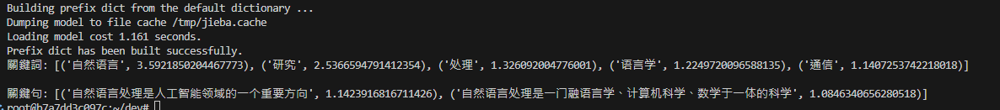
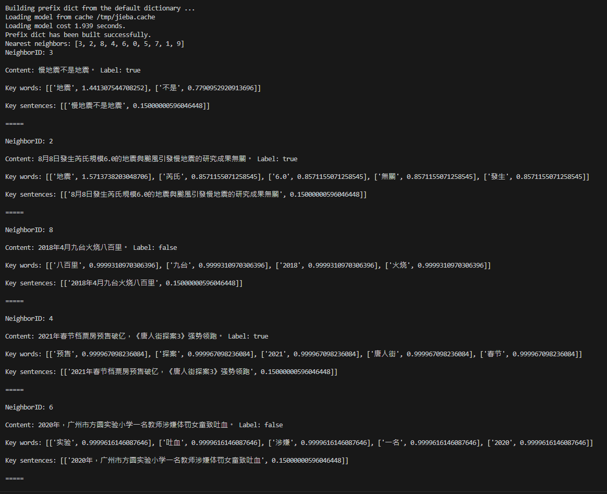

### 
#### 進度: 完成向量搜尋

- 文本預處理:
    - 
    - 分句: 將文本分割成句子。
    - 分詞: 將句子分割成詞彙（Jieba Text Rank）。
    - 詞向量: SentenceTransformer model = 'paraphrase-multilingual-MiniLM-L12-v2'

- 向量資料庫節點
    - Annoy
        - 靜態搜尋快
        - 區分時間段，例如一個禮拜內的新聞
        - 缺點: 構建九，300多筆，應該是5個多小時
    - 向量搜尋
        - 搜尋vector與目標vector之間的角度
        - 
    
- 目標
    - 搜尋結果先分析
        - use AI API
    - Google Search Result
        - 域值設定、結果紀錄ㄐ
